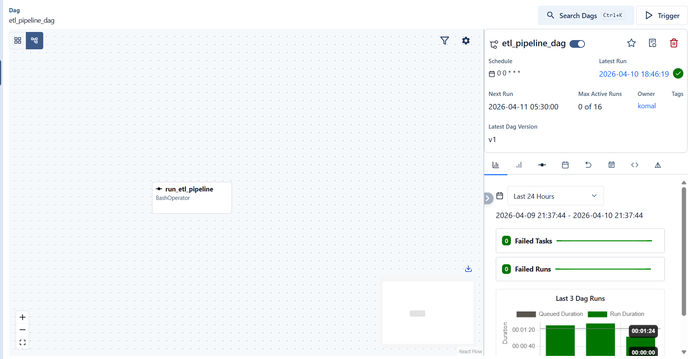

# 🚀 End-to-End Data Engineering Pipeline

  
  
  
  

  <b>Production-Ready ETL Pipeline using Python, PostgreSQL & Apache Airflow</b>

---

## 📌 Project Overview

This project demonstrates a **production-grade ETL (Extract, Transform, Load) pipeline** using Python, PostgreSQL, and Apache Airflow.

It processes real-world e-commerce data, performs transformation, and loads structured data into a database for analytics.

---

## 🧰 Tech Stack

- **Python (Pandas)**
- **PostgreSQL**
- **Apache Airflow**
- **Docker**
- **AWS S3**
- **Git & GitHub**

---
## ⚙️ Pipeline Architecture
Raw Data (CSV)  
↓  
Python ETL (Pandas)  
↓  
PostgreSQL Database  
↓  
Airflow Automation  

---

## 🔄 Workflow

### 🔹 Extract
- Load raw dataset (CSV)
- Source: Kaggle

### 🔹 Transform
- Removed null values and duplicates  
- Filtered invalid records  
- Converted data types  
- Created feature: `TotalPrice = Quantity × UnitPrice`  

### 🔹 Load
- Loaded data into PostgreSQL  
- Used `psycopg2`  
- Implemented batch insertion  

---

## 📊 Airflow Pipeline Execution

### ✅ DAG Success

  

---

## 📈 Key Highlights

- ✅ Built complete ETL pipeline  
- ✅ Handled real-world data issues  
- ✅ Integrated Python with PostgreSQL  
- ✅ Automated workflow using Airflow  
- ✅ Dockerized environment  

---

## 📊 Business Value

- 📈 Revenue analysis  
- 👥 Customer insights  
- 📉 Sales trend tracking  

---

## 🏁 Outcome

Developed a **scalable, modular pipeline** demonstrating strong data engineering skills.

---

## 🔮 Future Enhancements

- 🔁 Advanced Airflow scheduling  
- ☁️ AWS integration (S3 + EC2)  
- ⚡ PySpark for big data  
- 📊 Dashboard (Power BI / Streamlit)  

---

## 👨‍💻 Author

**Komal Kashyap**

---
