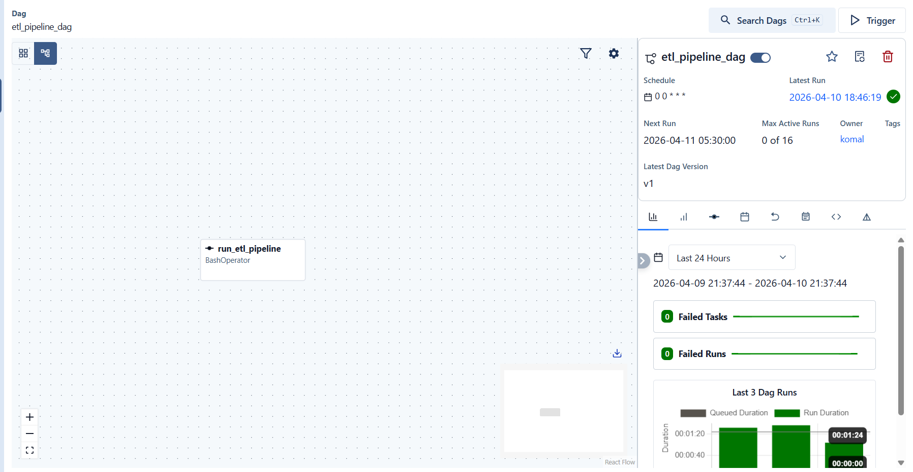

<h1 align="center">End-to-End ETL Pipeline with Apache Airflow</h1>

  <b>Automated Data Engineering pipeline using Python, PostgreSQL, Apache Airflow, Docker, and AWS S3</b>

  
  
  
  
  
  

---

## Project Overview

This project demonstrates an end-to-end Data Engineering ETL pipeline using Python, Apache Airflow, PostgreSQL, Docker, and AWS S3.

The pipeline extracts raw e-commerce data, applies transformation logic, and loads structured data into PostgreSQL for analytics. Apache Airflow is used to orchestrate and monitor the workflow.

## Tech Stack

- Python
- Pandas
- PostgreSQL
- Apache Airflow
- Docker
- AWS S3
- Git and GitHub

## Pipeline Architecture

Raw CSV Data  
↓  
Python ETL Script  
↓  
Data Cleaning and Transformation  
↓  
PostgreSQL Database  
↓  
Apache Airflow Orchestration  

## ETL Workflow

### Extract

The pipeline extracts raw e-commerce data from a CSV source.

### Transform

The transformation layer performs the following operations:

- Removes null records
- Removes duplicate records
- Filters invalid transactions
- Converts data types
- Creates calculated fields such as TotalPrice
- Prepares clean structured data for loading

### Load

The cleaned dataset is loaded into PostgreSQL for storage and analysis.

## Airflow Orchestration

Apache Airflow is used to schedule, run, and monitor the ETL workflow.

The DAG defines the task sequence for:

- Extracting data
- Transforming data
- Loading data into PostgreSQL
- Monitoring task success or failure

## Project Structure

etl-airflow-s3-project/

- dags/
  - Airflow DAG file
- data/
  - Raw dataset
- scripts/
  - ETL Python scripts
- images/
  - airflow_success.png
- docker-compose.yaml
- README.md
- requirements.txt

## Business Value

This pipeline prepares clean structured data for:

- Revenue analysis
- Sales trend analysis
- Customer behavior analysis
- Product performance analysis

## Screenshots

### Airflow DAG Execution

## How To Run

Install dependencies:

- pip install -r requirements.txt

Start Airflow with Docker:

- docker compose up

Open Airflow UI:

- http://localhost:8080

Run the DAG from the Airflow web interface.

## Key Skills Demonstrated

- ETL pipeline development
- Apache Airflow DAG creation
- Workflow orchestration
- Python data transformation
- PostgreSQL data loading
- Docker-based project setup
- AWS S3 object storage integration
- GitHub project documentation

## Future Improvements

- Add data quality checks
- Add logging for each pipeline stage
- Store raw and processed files separately in S3
- Add incremental data loading
- Add dashboard layer for reporting

## Project Explanation

This project shows how raw e-commerce data can be processed through an automated ETL workflow. Airflow manages the pipeline execution, Python handles the transformation logic, PostgreSQL stores the cleaned data, and S3 is used as object storage in the pipeline.

## Author

Komal Kashyap
